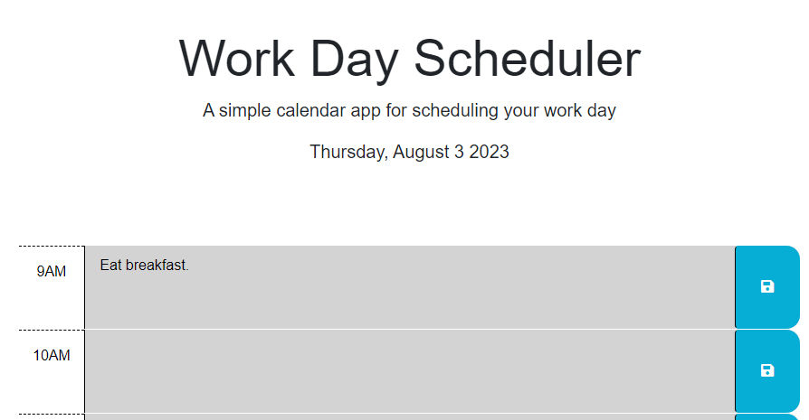

# Work Day Scheduler 

The code was pulled from module five and updated. Outside of the javascript, not too many changes were needed in the html or css file. Unfortunately, I left the js and style sheets in the Develop folder and did not create an original folder for them. I did not need to make as many pushes as I would normally since the project didn't require as much experimentation. 

# Version History

- "initial commit" - updated a small bit of html, reformatted the folder structure slightly.
- "added the date and committed things to local storage" - really quickly added the date and created a formula to commit text to local storage
- "added logic for color background" added the jv function for the background colors 
- "fixed issues with scheduler formatting" small copy and paste issue with the html caused the scheduler hour margins to be off. 
- "added the getStorage to jv" - added a getStorage function and added a text-center to the html to center the top text. 
- "added images to read me and added comments to code" - just cleaned up some code and the readme. 

# Live Deployment

https://waynecharr.github.io/Day_Scheduler/

# Live Images

